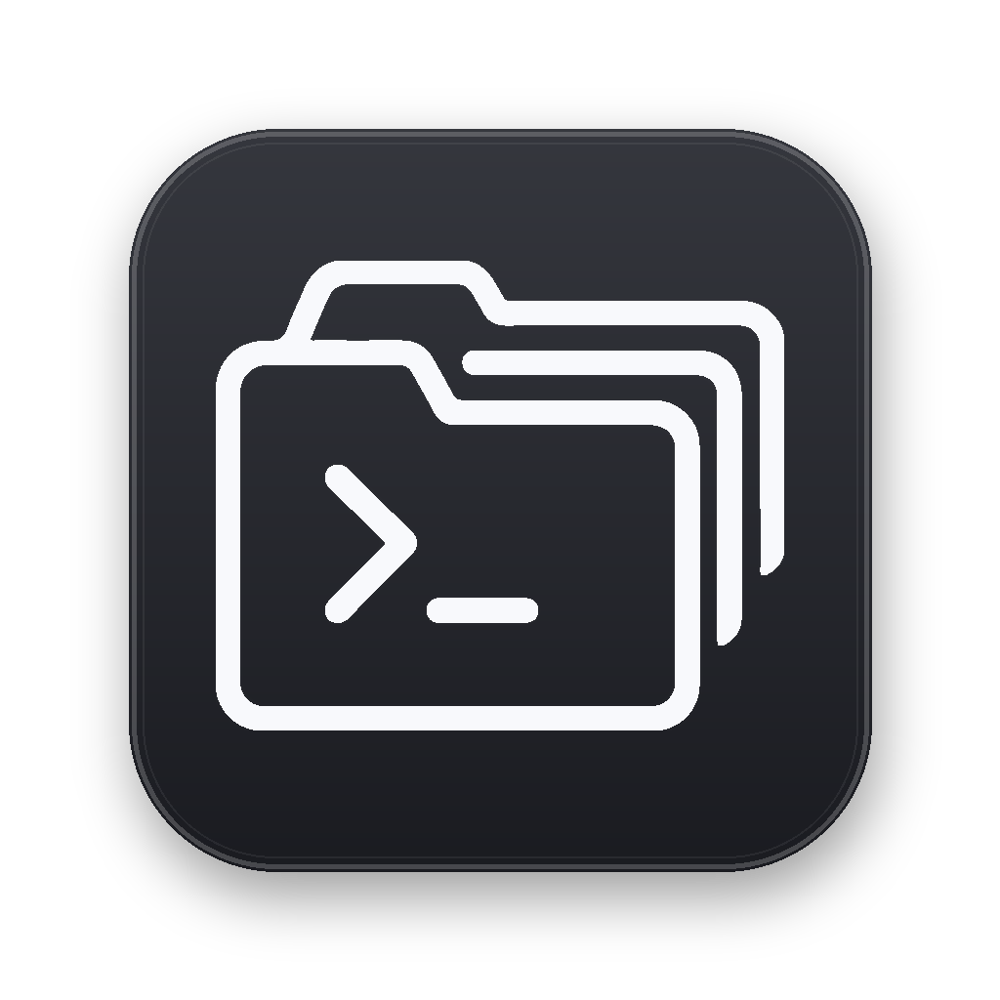

<p align="center">
  
</p>

<h1 align="center">Tabs IDE</h1>

<p align="center">
  <strong>A desktop workspace built for coding with agents.</strong><br />
  Chat, edit, browse, run commands, and manage Git without losing context.
</p>

<p align="center">
  <a href="#why-tabs">Why Tabs</a> ·
  <a href="#quick-start">Quick start</a> ·
  <a href="#how-it-works">How it works</a> ·
  <a href="#development">Development</a> ·
  <a href="#releases">Releases</a>
</p>

> [!NOTE]
> Tabs is under active development. Interfaces, workflows, and packaging may change between releases.

## Why Tabs

Coding with an agent usually means juggling a chat window, an editor, terminals, Git tools, and browser tabs. Tabs brings those surfaces into one project-aware desktop app so the agent and the developer work from the same context.

### One workspace, fewer handoffs

- **Agent conversations** with streaming responses and support for Codex and Claude
- **Code-OSS editor** embedded as a native desktop workbench
- **Terminal sessions** backed by local PTYs
- **Browser tools** with shared, isolated, or named persistent profiles
- **Git workflows** for branches, commits, diffs, stashes, merges, rebases, and pull requests
- **Project sessions** that preserve state across restarts
- **Cross-platform packaging** for macOS, Windows, and Linux

## Quick start

### Prerequisites

- [Bun](https://bun.sh/) 1.3.9 or newer in the 1.3 line
- Node.js 22.12 or newer
- A local Codex CLI and/or Claude CLI installation
- The compiled Code-OSS runtime in `tabs-code-main/`

### Install dependencies

```bash
cd tabs-main
bun install
```

### Prepare Code-OSS

The desktop app requires a compiled sibling checkout of `tabs-code-main`. If its compiled assets are missing, build that runtime using its documented toolchain before starting Tabs.

### Launch the desktop app

```bash
cd tabs-main
bun run dev:desktop
```

`dev:desktop` is the supported development entry point. The plain web development server does not provide Electron IPC, native editor hosting, or the desktop authentication bridge.

## How it works

```text
┌──────────────────────────── Tabs desktop (Electron) ────────────────────────┐
│                                                                             │
│   React workspace        Code-OSS workbench       Browser / terminals       │
│          │                       │                         │                  │
│          └────────────── project and session context ──────┘                  │
│                                  │                                          │
│                         local WebSocket server                              │
│                     ┌────────────┼────────────┐                             │
│                 agent runtime    Git       persistence                       │
└─────────────────────────────────────────────────────────────────────────────┘
```

The Electron shell owns the desktop window and native integrations. The React workspace provides Tabs' project and tool surfaces, while a compiled Code-OSS workbench is mounted inside the Code tool. A local server coordinates agent providers, terminals, Git operations, browser automation, and SQLite-backed state.

### Technology

| Area | Stack |
| --- | --- |
| Workspace UI | React 19, Vite, Tailwind CSS, Zustand, TanStack Router and Query |
| Desktop | Electron with an embedded Code-OSS workbench |
| Server | Node.js, Effect, WebSocket, SQLite |
| Agent providers | Codex app-server and Claude Agent SDK |
| Tooling | Bun, Turborepo, Vitest, Playwright, oxlint, oxfmt |

## Repository map

```text
tabs/
├── tabs-main/          Product monorepo
│   ├── apps/
│   │   ├── desktop/    Electron shell and native integrations
│   │   ├── marketing/  Public website
│   │   ├── server/     Local WebSocket backend
│   │   └── web/        React workspace UI
│   ├── packages/       Shared contracts and runtime libraries
│   └── scripts/        Development, build, and release tooling
├── tabs-code-main/     Tabs' Code-OSS runtime fork
├── .github/            CI, release workflows, and release notes
└── README.md
```

The two source trees have different responsibilities: `tabs-main/` is the Tabs product, while `tabs-code-main/` is the editor runtime bundled into desktop builds. Neither is generated output.

## Development

Run project commands from `tabs-main/`:

```bash
bun run dev:desktop   # Start the complete Electron application
bun run typecheck     # Check TypeScript across the monorepo
bun run lint          # Run oxlint
bun run fmt:check     # Verify formatting
bun run test          # Run the test tasks
```

Useful focused commands:

```bash
bun run dev:server
bun run dev:web
bun run dev:marketing
bun run test:desktop-smoke
```

### Browser profiles

Tabs keeps embedded-browser data in persistent Electron partitions:

- **Shared (Project)** shares one session between browser tabs in a project.
- **Isolated** gives one tab its own session.
- **Named Profile** shares a selected session across projects and tabs.

Sites remain responsible for their own authentication policies. Tabs does not copy cookies from external browsers, and some providers may block sign-in from an embedded browser.

## Releases

Desktop installers are self-contained and bundle the compiled Code-OSS runtime.

```bash
cd tabs-main
bun run dist:desktop:dmg         # macOS, current architecture
bun run dist:desktop:dmg:arm64   # macOS, Apple Silicon
bun run dist:desktop:dmg:x64     # macOS, Intel
bun run dist:desktop:win         # Windows NSIS installer
bun run dist:desktop:linux       # Linux AppImage
```

Windows installers should be built on Windows or in CI because the application includes native modules. Production tags use the release workflow and require a matching file in `.github/release-notes/`.

See [CHANGELOG.md](CHANGELOG.md) for shipped changes.

## Contributing

Before opening a change:

1. Read the [contribution guide](tabs-main/CONTRIBUTING.md).
2. Keep product changes in `tabs-main/` and editor-runtime changes in `tabs-code-main/`.
3. Run formatting, lint, type checking, and the relevant tests.
4. Document user-visible changes in the appropriate release notes.

Performance, reliability, and predictable recovery behavior take priority over clever shortcuts.

## License

Tabs is available under the [MIT License](tabs-main/LICENSE).
