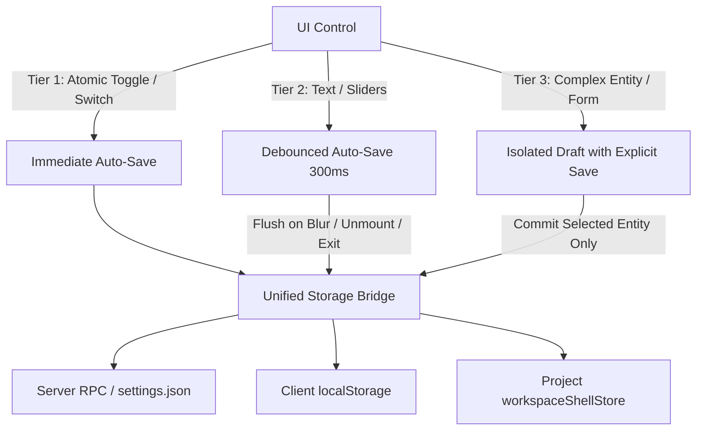

# Production-Readiness Audit: Settings Persistence, Draft Editors & Save/Apply Workflows

**Repository**: `Tabs IDE` (`tabs-main`)  
**Audit Target**: Editable settings, configuration forms, draft editors, and persistence lifecycles  
**Status**: Complete  
**Date**: September 2026

---

## 1. Executive Verdict

### **Verdict: CONDITIONAL NO-GO FOR PRODUCTION**

The Tabs IDE settings and configuration architecture contains fundamental transactional and boundary defects that lead to **silent data loss** and **unintentional persistence of uncommitted drafts**. Most critically:

1. **Confirmed Bug Reproduction**: In `ProjectWorkspaceSettingsSection.tsx`, editing fields in one entity (Browser Tab, Terminal Tab, or Server Preset) and subsequently performing an independent action—such as changing a browser session partition, deleting an unrelated item, or saving an unrelated tab—triggers whole-array persistence functions (`saveCustomEmbeds`, `saveServerProcesses`, `saveServerPresets`). This silently and permanently writes all dirty, unreviewed drafts into persistent storage (`localStorage` via `workspaceShellStore`) without the user clicking "Save Changes".
2. **Draft Destruction via Store Effect**: An active `useEffect([projectSettings])` in `ProjectWorkspaceSettingsSection.tsx` unconditionally re-hydrates drafts whenever _any_ project workspace property is modified (including toolbar drag-to-reorder, tool visibility toggle, or default browser settings save). This immediately destroys in-progress user drafts across all sub-tabs without confirmation or recovery.
3. **No Draft Retention Across Navigation**: Unsaved drafts in Project Workspace settings are stored in local React `useState`. Switching settings sections or closing Settings instantly unmounts the component, discarding all uncommitted user work without warning.
4. **Custom Theme Studio Auto-Commits During Preview**: Adjusting color pickers or styles in `CustomThemeStudioModal` writes directly to `localStorage` on every change and sets the active theme to `"custom"`. Closing the modal via "Cancel", "X", or `Escape` does not roll back changes.
5. **Keystroke Flooding & Bypassed Debouncers**: Although `useDebouncedSettingsUpdate` was implemented in `useSettings.ts`, **zero components in the entire repository utilize it**. Text inputs for provider binary paths, GitHub tokens, and custom models fire raw WebSocket RPCs to the server on every keystroke, while sliders write to `localStorage` on every pixel change.
6. **Zero Integration Tests for Settings UI**: Over 11,000 lines of settings UI code across 10 major components have zero test coverage for form drafts, transactional isolation, or cancel/save workflows.

Until the transactional boundaries, draft isolation, and debounced persistence contracts are fixed and backed by regression tests, these workflows are not safe for production deployment.

---

## 2. Confirmed Reproduction of the Reported Bug

### Primary Bug Report

> _In Project Workspace settings, editing fields such as a custom Browser tab, Terminal tab, or Server preset sometimes persists those edits even though the user did not click “Save Changes.” The behavior appears intermittent because another action may accidentally save the entire draft collection._

### Reproduction Paths (Confirmed by Code)

#### Path A: Changing Browser Session / Profile Commits All Unsaved Browser Tab Drafts

1. Open **Settings** -> **Workspace** -> **Project Tools** -> **Browser Tabs**.
2. Suppose Tab 1 exists with label `"API Docs"` and URL `"https://docs.local"`.
3. Select Tab 1. Edit the label to `"API Docs (Staging Draft)"` and the URL to `"https://staging.docs.local"`. **Do not click "Save Changes"**.
   - Tab 1 displays the blue "Unsaved changes" indicator.
   - The "Save Changes" and "Cancel" buttons become enabled.
4. In the Master-Detail sidebar, select Tab 2 (e.g. `"Metrics Dashboard"`).
5. In Tab 2's configuration, locate the **Browser Session** dropdown. Change the session partition from `"Shared with project"` to `"Named Profile"` -> `"Work"`.
6. **Trigger**: Changing the dropdown triggers `saveCustomEmbedPartition(embedId, "profile", "Work")` at `ProjectWorkspaceSettingsSection.tsx:1690`.
7. **Code Execution**:
   ```typescript
   // ProjectWorkspaceSettingsSection.tsx:991-1008
   const saveCustomEmbedPartition = (embedId, partitionMode, partitionProfile) => {
     const nextDrafts = customEmbedDrafts.map((entry) =>
       entry.id === embedId ? { ...entry, partitionMode, partitionProfile } : entry
     );
     setCustomEmbedDrafts(nextDrafts);
     saveCustomEmbeds(nextDrafts); // <-- PASSES ALL DRAFTS!
   ```
   `saveCustomEmbeds` maps over `nextDrafts` (which contains Tab 1's dirty draft) and writes the entire array into `upsertProjectSettings(projectId, ...)`:
   ```typescript
   // ProjectWorkspaceSettingsSection.tsx:954-988
   const saveCustomEmbeds = (overrideDrafts?: CustomEmbedDraft[]) => {
     const draftsToSave = Array.isArray(overrideDrafts) ? overrideDrafts : customEmbedDrafts;
     upsertProjectSettings(projectId, (current) => {
       const nextCustomEmbeds = draftsToSave.map((draft) => ({
         id: draft.id,
         label: draft.label.trim().length > 0 ? draft.label.trim() : "Untitled tab",
         url: draft.url.trim(),
         ...
       }));
       return { ...current, customEmbeds: nextCustomEmbeds, ... };
     });
   };
   ```
8. **Result**: Tab 1's dirty label `"API Docs (Staging Draft)"` and URL `"https://staging.docs.local"` are committed to `workspaceShellStore` and written to `localStorage`.
9. **Collateral Damage**:
   - The user sees a toast: `"Browser session assignment saved"`. There is no mention of Tab 1.
   - The store update changes `projectSettings`, which triggers `useEffect([projectSettings])` at line 723:
     `setCustomEmbedDrafts(createCustomEmbedDrafts(projectSettings));`
   - Tab 1 is re-initialized with `originalLabel = "API Docs (Staging Draft)"`. Tab 1's "Unsaved" marker disappears.
   - If the user was also drafting a Server Preset or Terminal Tab, their drafts are **wiped out** by `setServerPresetDrafts(createServerPresetDrafts(projectSettings))`.

#### Path B: Deleting One Item Commits In-Progress Edits on All Remaining Items

1. User edits Tab A's label to `"Test Draft"`. Unsaved.
2. User clicks "Delete Tab" on an obsolete Tab B.
3. User confirms deletion in the alert dialog.
4. **Code Execution** (`ProjectWorkspaceSettingsSection.tsx:2201-2205`):
   ```typescript
   const nextDrafts = customEmbedDrafts.filter((entry) => entry.id !== tabToDeleteId);
   setCustomEmbedDrafts(nextDrafts);
   saveCustomEmbeds(nextDrafts); // <-- COMMITS TAB A!
   ```
5. **Result**: Tab A's unsaved draft is committed to persistent storage.
6. The same exact defect exists for Terminal Tabs (`saveServerProcesses(nextDrafts)` at line 2244) and Server Presets (`saveServerPresets(nextDrafts)` at line 2283).

#### Path C: Saving Item A Commits Dirty Item B in the Same Collection

1. User adds or edits Tab A.
2. User selects Tab B and edits Tab B.
3. While viewing Tab B, user clicks "Save Changes".
4. **Code Execution** (`ProjectWorkspaceSettingsSection.tsx:1722`):
   `onClick={() => saveCustomEmbeds()}`
   `saveCustomEmbeds` without arguments defaults to `customEmbedDrafts`.
5. **Result**: Both Tab A and Tab B are committed simultaneously.

---

## 3. Persistence-Model Inventory Table

| Surface / Component   | Source File                           | Field / Action                             | Intended Model           | Actual Trigger                       | Backing Store                                      | Cross-Draft Contamination? | Failure / Rollback / Status               |
| :-------------------- | :------------------------------------ | :----------------------------------------- | :----------------------- | :----------------------------------- | :------------------------------------------------- | :------------------------- | :---------------------------------------- |
| **General Settings**  | `GeneralSettings.tsx`                 | Interface Zoom                             | Immediate                | Slider `onChange`                    | `localStorage`                                     | No                         | Direct write, no status                   |
| **General Settings**  | `GeneralSettings.tsx`                 | Desktop Icon Theme                         | Immediate                | SegmentedControl `onValueChange`     | `tabs:client-settings:v1`                          | No                         | Optimistic, "Saved" toast                 |
| **General Settings**  | `GeneralSettings.tsx`                 | Timestamp Format                           | Immediate                | SegmentedControl `onValueChange`     | `tabs:client-settings:v1`                          | No                         | Optimistic, "Saved" toast                 |
| **General Settings**  | `GeneralSettings.tsx`                 | Diff Color Scheme                          | Immediate                | SegmentedControl `onValueChange`     | `tabs:client-settings:v1`                          | No                         | Optimistic, "Saved" toast                 |
| **General Settings**  | `GeneralSettings.tsx`                 | Panel Animation Duration                   | Debounced                | Slider `onChange` (every tick!)      | `tabs:client-settings:v1`                          | No                         | High-frequency direct write               |
| **General Settings**  | `GeneralSettings.tsx`                 | Reduced Motion Mode                        | Immediate                | SegmentedControl `onValueChange`     | `tabs:client-settings:v1`                          | No                         | Optimistic, "Saved" toast                 |
| **General Settings**  | `GeneralSettings.tsx`                 | AI Provider (Tabs vs Copilot)              | Immediate                | SegmentedControl `onValueChange`     | `tabs:client-settings:v1`                          | No                         | Optimistic, "Saved" toast                 |
| **General Settings**  | `GeneralSettings.tsx`                 | Assistant Streaming                        | Immediate                | Switch `onCheckedChange`             | Server RPC (`settings.json`)                       | No                         | Optimistic, rollback, global status       |
| **General Settings**  | `GeneralSettings.tsx`                 | Always Create Tasks                        | Immediate                | Switch `onCheckedChange`             | Server RPC (`settings.json`)                       | No                         | Optimistic, rollback, global status       |
| **General Settings**  | `GeneralSettings.tsx`                 | Text Generation Model & Options            | Immediate                | Model/Options Picker `onChange`      | Server RPC (`settings.json`)                       | No                         | Optimistic, rollback, global status       |
| **General Settings**  | `GeneralSettings.tsx`                 | Diff Line Wrapping                         | Immediate                | Switch `onCheckedChange`             | `tabs:client-settings:v1`                          | No                         | Optimistic, "Saved" toast                 |
| **General Settings**  | `GeneralSettings.tsx`                 | Colorize Permissions                       | Immediate                | Switch `onCheckedChange`             | `tabs:client-settings:v1`                          | No                         | Optimistic, "Saved" toast                 |
| **General Settings**  | `GeneralSettings.tsx`                 | Default Thread Env Mode                    | Immediate                | Select `onValueChange`               | Server RPC (`settings.json`)                       | No                         | Optimistic, rollback, global status       |
| **General Settings**  | `GeneralSettings.tsx`                 | Confirm Thread Delete                      | Immediate                | Switch `onCheckedChange`             | `tabs:client-settings:v1`                          | No                         | Optimistic, "Saved" toast                 |
| **General Settings**  | `GeneralSettings.tsx`                 | Confirm Tab Close                          | Immediate                | Switch `onCheckedChange`             | `tabs:client-settings:v1`                          | No                         | Optimistic, "Saved" toast                 |
| **General Settings**  | `GeneralSettings.tsx`                 | Confirm Before Quit                        | Immediate                | Switch `onCheckedChange`             | Electron Main IPC                                  | No                         | Main process store                        |
| **General Settings**  | `GeneralSettings.tsx`                 | OS Notifications Toggle                    | Immediate                | Switch `onCheckedChange`             | `localStorage`                                     | No                         | Permission-gated                          |
| **General Settings**  | `GeneralSettings.tsx`                 | Restore Defaults                           | Explicit Confirm         | Dialog Confirm Click                 | Multi-store (`client` + `server`)                  | No                         | Partial rollback risk                     |
| **Animations**        | `AnimationsSettings.tsx`              | Startup/Close Loader Style, Palette, Theme | Explicit Save            | "Save Settings" Button Click         | `tabs:client-settings:v1`                          | No                         | Clean until saved; unmount loses drafts   |
| **Animations**        | `AnimationsSettings.tsx`              | Startup/Close Animation Fonts              | Explicit Save            | "Save Settings" Button Click         | `localStorage` (`tabs.*AnimationFont*`)            | No                         | Mixed backing store for single form       |
| **Animations**        | `AnimationsSettings.tsx`              | Fullscreen Preview & Replay                | Temporary Preview        | "Preview" / "Replay" Button Click    | In-memory only                                     | No                         | Side-effect free (correct)                |
| **Animations**        | `AnimationsSettings.tsx`              | Slider Animations / Track Fill             | Immediate                | Switch `onCheckedChange`             | `tabs:client-settings:v1`                          | No                         | Immediate auto-save on explicit form page |
| **Themes**            | `ThemesSettings.tsx`                  | Built-in Theme Picker                      | Immediate                | Click theme card                     | `localStorage` (`tabs:theme`)                      | No                         | Immediate write                           |
| **Themes**            | `ThemesSettings.tsx`                  | Font Combos & UI Fonts                     | Immediate                | Select `onValueChange`               | `localStorage` (`tabs:font-preferences`)           | No                         | Immediate write                           |
| **Themes**            | `ThemesSettings.tsx`                  | Font Size Sliders (UI, Code, Prompt)       | Debounced                | Slider `onChange` (every pixel!)     | `tabs:font-preferences` & `client-settings`        | No                         | High-frequency direct write; dual store   |
| **Themes**            | `ThemesSettings.tsx`                  | Toolbar Style                              | Immediate                | Click style card                     | `tabs:client-settings:v1`                          | No                         | Immediate write                           |
| **Theme Studio**      | `CustomThemeStudioModal.tsx`          | Colors, Presets, Token Overrides           | Explicit Save (Presumed) | Color picker `onChange` (Immediate!) | `localStorage` (`tabs:custom-theme`, `tabs:theme`) | **YES**                    | **No rollback on Cancel/Close**           |
| **Providers**         | `ProvidersSettings.tsx`               | Provider Binary Paths                      | Debounced                | Input `onChange` (every keystroke!)  | Server RPC (`settings.json`)                       | No                         | Keystroke flooding to server              |
| **Providers**         | `ProvidersSettings.tsx`               | Codex Home Path                            | Debounced                | Input `onChange` (every keystroke!)  | Server RPC (`settings.json`)                       | No                         | Keystroke flooding to server              |
| **Providers**         | `ProvidersSettings.tsx`               | Copilot GHE Host & Token                   | Debounced                | Input `onChange` (every keystroke!)  | Server RPC (`settings.json`)                       | No                         | Keystroke flooding to server              |
| **Providers**         | `ProvidersSettings.tsx`               | Custom Model Slugs                         | Explicit Save            | "Add Model" / Trash click            | Server RPC (`settings.json`)                       | No                         | Immediate RPC                             |
| **Providers**         | `ProvidersSettings.tsx`               | Pinned Models                              | Immediate                | Pin icon click                       | `tabs:client-settings:v1`                          | No                         | Immediate write                           |
| **Providers**         | `ProvidersSettings.tsx`               | Model Ordering                             | Explicit / Drag          | Drag end / Reset click               | Server RPC (`settings.json`)                       | No                         | Immediate RPC                             |
| **Providers**         | `ProvidersSettings.tsx`               | Hidden Models                              | Immediate                | Eye toggle click                     | Server RPC (`settings.json`)                       | No                         | Immediate RPC                             |
| **Notifications**     | `NotificationsSettings.tsx`           | OS Notification Categories                 | Immediate                | Switch `onCheckedChange`             | `localStorage` (`tabs.notifications.categories`)   | No                         | Immediate write                           |
| **Notifications**     | `NotificationsSettings.tsx`           | Notification History Actions               | Immediate                | Mark read, delete, clear             | `sessionStorage` (`tabs:notification-history`)     | No                         | Immediate write                           |
| **Keybindings**       | `KeybindingsSettings.tsx`             | Shortcut Edit                              | Immediate                | Shortcut recorder capture            | Server RPC (`keybindings.json`)                    | No                         | Immediate RPC                             |
| **Keybindings**       | `KeybindingsSettings.tsx`             | Add Keybinding Dialog                      | Explicit Save            | "Add Keybinding" button              | Server RPC (`keybindings.json`)                    | No                         | Immediate RPC                             |
| **Keybindings**       | `KeybindingsSettings.tsx`             | Keybinding JSON Import                     | Explicit Apply           | File select `handleFileChange`       | Server RPC (`keybindings.json`)                    | No                         | Unrolled loop; partial failure risk       |
| **Browser Profiles**  | `BrowserProfilesSettings.tsx`         | Create / Edit Profile                      | Explicit Save            | "Create Profile" / "Save Changes"    | `tabs:client-settings:v1`                          | No                         | Immediate write                           |
| **Browser Profiles**  | `BrowserProfilesSettings.tsx`         | Delete Profile                             | Explicit Confirm         | Confirm dialog click                 | Multi-store (`native` + `project` + `client`)      | **YES**                    | Writes across all project settings        |
| **Browser Profiles**  | `BrowserProfilesSettings.tsx`         | Browser Link Target                        | Immediate                | Select `onValueChange`               | `tabs:client-settings:v1`                          | No                         | Immediate write                           |
| **Project Workspace** | `ProjectWorkspaceSettingsSection.tsx` | Active Project Icon                        | Explicit Apply           | Picker dialog select                 | Server command (`project.meta.update`)             | No                         | RPC command                               |
| **Project Workspace** | `ProjectWorkspaceSettingsSection.tsx` | Toolbar Tools Reorder                      | Immediate                | Drag end `handleReorderTools`        | `workspaceShellStore` (`localStorage`)             | **YES**                    | **Wipes dirty drafts in sub-tabs**        |
| **Project Workspace** | `ProjectWorkspaceSettingsSection.tsx` | Toolbar Tool Visibility                    | Explicit Confirm         | Confirm dialog click                 | `workspaceShellStore` (`localStorage`)             | **YES**                    | **Wipes dirty drafts in sub-tabs**        |
| **Project Workspace** | `ProjectWorkspaceSettingsSection.tsx` | Default Browser URL                        | Explicit Save            | "Save" Button click                  | `workspaceShellStore` (`localStorage`)             | **YES**                    | **Wipes dirty drafts in sub-tabs**        |
| **Project Workspace** | `ProjectWorkspaceSettingsSection.tsx` | Custom Browser Tab Edits                   | Explicit Save            | "Save Changes" Button click          | `workspaceShellStore` (`localStorage`)             | **YES**                    | Whole-array save; commits other tabs      |
| **Project Workspace** | `ProjectWorkspaceSettingsSection.tsx` | Browser Tab Partition / Profile            | Immediate                | Select `onValueChange`               | `workspaceShellStore` (`localStorage`)             | **YES**                    | **Commits all dirty browser tab drafts**  |
| **Project Workspace** | `ProjectWorkspaceSettingsSection.tsx` | Delete Browser Tab                         | Explicit Confirm         | Confirm dialog click                 | `workspaceShellStore` (`localStorage`)             | **YES**                    | **Commits remaining dirty tab drafts**    |
| **Project Workspace** | `ProjectWorkspaceSettingsSection.tsx` | Cancel Browser Tab Edits                   | Explicit Cancel          | "Cancel" Button click                | Local React `useState`                             | **YES**                    | Resets all tabs to persisted state        |
| **Project Workspace** | `ProjectWorkspaceSettingsSection.tsx` | Custom Terminal Tab Edits                  | Explicit Save            | "Save Changes" Button click          | `workspaceShellStore` (`localStorage`)             | **YES**                    | Whole-array save; commits other tabs      |
| **Project Workspace** | `ProjectWorkspaceSettingsSection.tsx` | Delete Terminal Tab                        | Explicit Confirm         | Confirm dialog click                 | `workspaceShellStore` (`localStorage`)             | **YES**                    | **Commits remaining terminal drafts**     |
| **Project Workspace** | `ProjectWorkspaceSettingsSection.tsx` | Server Preset Edits (Settings)             | Explicit Save            | "Save Changes" Button click          | `workspaceShellStore` (`localStorage`)             | **YES**                    | Whole-array save; commits other presets   |
| **Project Workspace** | `ProjectWorkspaceSettingsSection.tsx` | Delete Server Preset                       | Explicit Confirm         | Confirm dialog click                 | `workspaceShellStore` (`localStorage`)             | **YES**                    | **Commits remaining preset drafts**       |
| **Preset Editor**     | `WorkspaceShell.tsx`                  | Preset Reorder (Left List)                 | Immediate                | Drop `handleDrop`                    | `workspaceShellStore` (`localStorage`)             | **YES**                    | Whole-array save while editing right pane |
| **Preset Editor**     | `WorkspaceShell.tsx`                  | Delete Preset                              | Explicit Confirm         | Confirm dialog click                 | `workspaceShellStore` (`localStorage`)             | **YES**                    | Whole-array save                          |
| **Preset Editor**     | `WorkspaceShell.tsx`                  | Edit Preset (Right Pane)                   | Explicit Save            | "Save Changes" Button click          | `workspaceShellStore` (`localStorage`)             | **YES**                    | Whole-array save                          |
| **Preset Editor**     | `WorkspaceShell.tsx`                  | Run Preset with Preview URL                | Runtime Action           | "Run" button click                   | `workspaceShellStore` (`localStorage`)             | No                         | Mutates browser `currentUrl` in store     |
| **Connections**       | `ConnectionsSettings.tsx`             | Add Remote / SSH Environment               | Explicit Save            | "Connect" Button click               | `manualConnections` store                          | No                         | Verified before save (correct)            |
| **Usage Limits**      | `AddUsageLimitSourceDialog.tsx`       | Add CLIProxyAPI Hub                        | Explicit Save            | "Add Hub" Button click               | Server RPC (`settings.json`)                       | No                         | Closes before RPC completes               |
| **Diagnostics**       | `DiagnosticsSettings.tsx`             | Background Activity Profile                | Immediate                | SegmentedControl `onValueChange`     | Server RPC (`settings.json`)                       | No                         | Bypasses `useSettings`, unhandled error   |

---

## 4. Comprehensive Findings Ranked by Severity

### P0 — Critical Data Loss & Unintended Persistence Blockers

---

#### Finding 1: Cross-Draft Silent Commit Triggered by Browser Tab Partition / Profile Assignment

- **Severity**: P0 (Critical) | **Confidence**: Confirmed by code
- **Affected Files & Symbols**:
  - `apps/web/src/components/ProjectWorkspaceSettingsSection.tsx`: `saveCustomEmbedPartition` (lines 991–1018), `saveCustomEmbeds` (lines 954–989)
- **Reproduction Steps**:
  1. Open Settings -> Workspace -> Browser Tabs.
  2. Select Tab A. Edit its label to `"Experimental Preview"` and URL to `"http://localhost:9999"`. Do not save.
  3. Select Tab B. Change its session partition mode to `"Named Profile"` -> `"Personal"`.
  4. Observe toast: `"Browser session assignment saved"`.
  5. Inspect `localStorage.getItem("tabs:workspace-shell:v2")`.
- **Expected Behavior**: Changing Tab B's session mode should update only Tab B's partition mode and profile in storage, leaving Tab A's uncommitted label and URL in an unsaved draft state.
- **Actual Behavior**: `saveCustomEmbedPartition` calls `saveCustomEmbeds(nextDrafts)` where `nextDrafts` contains the active `customEmbedDrafts` array. Tab A's uncommitted label and URL are committed immediately to `localStorage`.
- **Root Cause**: `saveCustomEmbeds` is a whole-array serializer. `saveCustomEmbedPartition` was written as a shortcut that saves all drafts rather than applying an isolated single-entity update or isolating the partition setting.
- **User Impact**: Incomplete, private, or invalid URLs/labels drafted by the user are silently persisted without their consent.
- **Recommended Fix**:
  1. Decouple single-field partition assignment from draft collection persistence.
  2. Modify `saveCustomEmbedPartition` to update only the specific entity in `projectSettings` using its persisted values for other fields, leaving drafts untouched.
- **Required Regression Test**:
  - `ProjectWorkspaceSettingsSection.test.tsx`: "changing Tab B partition mode preserves Tab A dirty draft without saving Tab A to store".

---

#### Finding 2: Cross-Draft Silent Commit Triggered by Deleting Any Browser Tab, Terminal Tab, or Preset

- **Severity**: P0 (Critical) | **Confidence**: Confirmed by code
- **Affected Files & Symbols**:
  - `apps/web/src/components/ProjectWorkspaceSettingsSection.tsx`: lines 2201–2205 (Tabs), 2240–2244 (Terminals), 2279–2284 (Presets)
- **Reproduction Steps**:
  1. Edit Server Preset A commands from `npm test` to `npm run build && rm -rf dist`. Do not save.
  2. Click "Delete Preset" on an unused Preset B. Confirm deletion.
  3. Inspect `localStorage.getItem("tabs:workspace-shell:v2")`.
- **Expected Behavior**: Preset B is removed from storage. Preset A remains in memory as an unsaved draft with its original baseline intact.
- **Actual Behavior**: Deleting Preset B invokes `saveServerPresets(nextDrafts)`. This commits Preset A's new command step `rm -rf dist` to disk and marks Preset A as clean (`originalCommands = [...draft.commands]`).
- **Root Cause**: Delete dialog confirmations directly invoke the bulk save helpers (`saveCustomEmbeds`, `saveServerProcesses`, `saveServerPresets`) with the filtered draft array instead of filtering the persisted store directly.
- **User Impact**: Destructive or accidental commands in drafts become permanently saved when deleting another item.
- **Recommended Fix**:
  - Delete handlers must perform a single-entity deletion against `current` persisted settings in `upsertProjectSettings` without committing draft arrays.
- **Required Regression Test**:
  - `ProjectWorkspaceSettingsSection.test.tsx`: "deleting Preset B leaves Preset A draft dirty and does not persist Preset A changes".

---

#### Finding 3: In-Progress Draft Obliteration via `useEffect([projectSettings])` Triggered by Unrelated Operations

- **Severity**: P0 (Critical) | **Confidence**: Confirmed by code
- **Affected Files & Symbols**:
  - `apps/web/src/components/ProjectWorkspaceSettingsSection.tsx`: lines 723–733
- **Reproduction Steps**:
  1. Open Settings -> Workspace -> Terminal Tabs.
  2. Type a multi-line script into Terminal 1's command list. Do not save.
  3. Scroll up to "Toolbar Tools". Drag any tool to reorder it, or toggle a tool's visibility.
  4. Observe Terminal 1's form.
- **Expected Behavior**: The user's in-progress command edits in Terminal 1 remain intact.
- **Actual Behavior**: The entire script in Terminal 1 is wiped out and replaced with the previously saved commands from disk.
- **Root Cause**:
  ```typescript
  useEffect(() => {
    if (!projectSettings) { ...; return; }
    setCustomEmbedDrafts(createCustomEmbedDrafts(projectSettings));
    setServerProcessDrafts(createTerminalProcessDrafts(projectSettings));
    setServerPresetDrafts(createServerPresetDrafts(projectSettings));
  }, [projectSettings, activeProjectId]);
  ```
  `projectSettings` updates on _any_ workspace change (tool reorder, visibility toggle, default browser URL save, icon change). The effect has no dirty check and unconditionally resets all draft arrays.
- **User Impact**: Severe data loss of complex configurations while configuring other workspace settings.
- **Recommended Fix**:
  - Store drafts per item ID and guard store re-hydration: never overwrite an item's draft if `isDirty(draft)` is true, or key drafts by project ID in a persistent draft store.
- **Required Regression Test**:
  - `ProjectWorkspaceSettingsSection.test.tsx`: "reordering toolbar tools does not reset dirty Terminal, Browser, or Preset drafts".

---

### P1 — High Severity Architectural & Workflow Defects

---

#### Finding 4: Silent Data Loss on Settings Section Navigation or Modal Close

- **Severity**: P1 (High) | **Confidence**: Confirmed by code
- **Affected Files & Symbols**:
  - `apps/web/src/routes/_chat.settings.tsx`: lines 530–537
  - `apps/web/src/components/ProjectWorkspaceSettingsSection.tsx`: lines 545–547
- **Reproduction Steps**:
  1. Edit a custom browser tab or server preset.
  2. In the Settings sidebar, click "General", "Themes", or click the "Back" button.
  3. Navigate back to "Workspace".
- **Expected Behavior**: Either the user is warned with an "Unsaved Changes" dialog before navigating, or drafts are persisted in `scopedStateStore` so they remain when returning.
- **Actual Behavior**: The component unmounts. All drafts in `useState` are garbage-collected and permanently lost.
- **Root Cause**: Draft state is stored in ephemeral React `useState` inside `ProjectWorkspaceSettingsSection`, unlike `draftModelOrders` which uses `scopedStateStore`.
- **Recommended Fix**:
  - Lift draft collections into `scopedStateStore` (keyed by project ID) and/or add a navigation blocker/guard when `isDirty` is true across any settings section.
- **Required Regression Test**:
  - `_chat.settings.test.tsx`: "navigating between settings sections preserves uncommitted workspace drafts".

---

#### Finding 5: Custom Theme Studio Immediate Persistence Without Rollback on Cancel

- **Severity**: P1 (High) | **Confidence**: Confirmed by code
- **Affected Files & Symbols**:
  - `apps/web/src/components/settings/ThemesSettings.tsx`: lines 1582–1587
  - `apps/web/src/hooks/useTheme.ts`: lines 526–538
  - `apps/web/src/components/CustomThemeStudioModal.tsx`: lines 91–109
- **Reproduction Steps**:
  1. Go to Settings -> Themes. Click "Customize Theme" to open Custom Theme Studio.
  2. Change background color to `#FF0000` (bright red).
  3. Notice the entire application background immediately turns red.
  4. Click the "X" button or press Escape to close the Studio modal without clicking "Save Preset".
  5. Reload the app.
- **Expected Behavior**: Closing the studio without saving should revert the theme back to the previous theme.
- **Actual Behavior**: The red theme remains applied and permanently saved in `localStorage["tabs:custom-theme"]` and `localStorage["tabs:theme"] = "custom"`.
- **Root Cause**: `ThemesSettings.tsx:1582` connects the studio's `onChange` directly to `setCustomThemeConfig(next)` and `setTheme("custom")`, which write to `localStorage` on every change event.
- **Recommended Fix**:
  - Pass a local draft state to `CustomThemeStudioModal`. Apply temporary CSS variables to the document preview without writing to `localStorage`. Only persist to `localStorage` when the user clicks "Save Preset" or "Apply".
- **Required Regression Test**:
  - `CustomThemeStudioModal.test.tsx`: "closing studio without saving reverts CSS variables and preserves previous localStorage theme".

---

#### Finding 6: Partial-Failure State Corruption in Batch Keybinding Import

- **Severity**: P1 (High) | **Confidence**: Confirmed by code
- **Affected Files & Symbols**:
  - `apps/web/src/components/settings/KeybindingsSettings.tsx`: lines 1160–1189
- **Reproduction Steps**:
  1. In Keybindings Settings, click "Import from JSON".
  2. Select a JSON file containing 20 valid rules followed by 1 invalid rule.
- **Expected Behavior**: The import should either be atomic (all-or-nothing transaction) or offer a clean rollback.
- **Actual Behavior**: The loop sequentially awaits `onUpsert` for each rule. The first 20 rules are permanently written to `keybindings.json` on the server. The 21st throws an error, triggering a toast, leaving the user with a partially imported state that cannot be undone.
- **Root Cause**: `handleFileChange` issues individual RPC calls sequentially in a client-side loop rather than submitting a single batch import RPC `server.importKeybindings(rules)`.
- **Recommended Fix**:
  - Add a server-side transactional RPC `server.importKeybindings` that validates and applies the entire rule set atomically.
- **Required Regression Test**:
  - `KeybindingsSettings.test.tsx`: "aborted keybindings import does not leave partial rules persisted".

---

### P2 — Moderate Severity Performance, Integrity & Sync Defects

---

#### Finding 7: Unused `useDebouncedSettingsUpdate` and Keystroke Flooding to Server RPC / Storage

- **Severity**: P2 (Moderate) | **Confidence**: Confirmed by code
- **Affected Files & Symbols**:
  - `apps/web/src/hooks/useSettings.ts`: lines 379–407
  - `apps/web/src/components/settings/ProvidersSettings.tsx`: lines 1511–1528, 1638–1675
  - `apps/web/src/components/settings/GeneralSettings.tsx`: line 450
  - `apps/web/src/components/settings/ThemesSettings.tsx`: lines 1374, 1413, 1456
- **Reproduction Steps**:
  1. In Providers -> Codex, type `/opt/homebrew/bin/codex` in the binary path input.
  2. Monitor WebSocket frames in DevTools.
- **Expected Behavior**: Input changes are debounced (e.g. 300ms) or flushed on blur.
- **Actual Behavior**: 24 separate WebSocket RPC calls to `server.updateSettings` are dispatched—one per keystroke. Each RPC triggers disk I/O on the server to write `settings.json`.
- **Root Cause**: `useDebouncedSettingsUpdate` was implemented but never imported or wired into form controls. All inputs wire `onChange` directly to `updateSettings`.
- **Recommended Fix**:
  - Wire text inputs and range sliders to `useDebouncedSettingsUpdate` and ensure blur/enter flush immediately.
- **Required Regression Test**:
  - `ProvidersSettings.test.tsx`: "typing rapidly in binary path input dispatches only one debounced update".

---

#### Finding 8: `SettingsPersistenceStatus` Disconnect from Project Workspace Settings

- **Severity**: P2 (Moderate) | **Confidence**: Confirmed by code
- **Affected Files & Symbols**:
  - `apps/web/src/routes/_chat.settings.tsx`: lines 466, 491
  - `apps/web/src/components/settings/SettingsPersistenceStatus.tsx`
  - `apps/web/src/components/ProjectWorkspaceSettingsSection.tsx`
- **Reproduction Steps**:
  1. Open Settings -> Workspace.
  2. Make edits to a Browser Tab (unsaved).
  3. Observe the global Settings header status indicator.
- **Expected Behavior**: The header indicator accurately reflects overall settings persistence state, or explicitly indicates workspace draft status.
- **Actual Behavior**: The header indicator either shows nothing (idle) or displays "Saved" (if a client setting autosaved earlier), misleading the user into believing their workspace settings are saved.
- **Root Cause**: `SettingsPersistenceStatus` exclusively subscribes to `useSettingsPersistence()` (`UnifiedSettings`). Project workspace settings reside in `workspaceShellStore` and do not participate in the persistence state atom.
- **Recommended Fix**:
  - Either integrate `workspaceShellStore` persistence status into `SettingsPersistenceStatus` or add a dedicated draft status indicator inside `ProjectWorkspaceSettingsSection`.
- **Required Regression Test**:
  - `SettingsPersistenceStatus.test.tsx`: "header status does not indicate Saved while workspace drafts are dirty".

---

#### Finding 9: Unreliable Debounced Flush on Window Unload in Electron

- **Severity**: P2 (Moderate) | **Confidence**: Confirmed by code
- **Affected Files & Symbols**:
  - `apps/web/src/hooks/useSettings.ts`: lines 387–396
  - `apps/web/src/hooks/useAppClosing.ts`
- **Reproduction Steps**:
  1. User edits a debounced text field.
  2. User presses `Cmd+Q` within 100ms.
- **Expected Behavior**: Pending debounced changes are reliably flushed and awaited before the process exits.
- **Actual Behavior**: `handleBeforeUnload` executes `void updaterRef.current?.flush()`. The Promise is un-awaited. In Electron, the renderer window can close before the WebSocket frame leaves the network stack.
- **Root Cause**: `beforeunload` does not coordinate with Electron's `onAppClosing` IPC signal.
- **Recommended Fix**:
  - Coordinate shutdown via `desktopBridge.onAppClosing` to await pending settings flushes before signalling `cleanupDone`.
- **Required Regression Test**:
  - `useSettings.test.tsx`: "flush is called and awaited during app closing lifecycle".

---

#### Finding 10: Non-Atomic Mixed Client/Server Setting Rollback

- **Severity**: P2 (Moderate) | **Confidence**: Confirmed by code
- **Affected Files & Symbols**:
  - `apps/web/src/hooks/useSettings.ts`: lines 199–228, 275–292
- **Reproduction Steps**:
  1. Call `applySettingsUpdate({ diffWordWrap: true, enableAssistantStreaming: true })`.
  2. Simulate server RPC failure.
- **Expected Behavior**: Both settings roll back, and retry attempts to re-apply both.
- **Actual Behavior**: `enableAssistantStreaming` rolls back to `false`, but `diffWordWrap: true` remains written in `localStorage`. The `retry` function only retries `serverPatch`.
- **Root Cause**: `splitPatch` splits the patch into client and server halves. Client patch executes immediately without snapshotting previous client state for rollback.
- **Recommended Fix**:
  - Capture previous client settings and roll back `localStorage` if server RPC fails in a mixed patch. Retain the full combined patch in `failedPatch` and `retry`.
- **Required Regression Test**:
  - `useSettings.test.tsx`: "rolling back a failed mixed patch reverts client settings and provides full retry patch".

---

#### Finding 11: Whole-Array Multi-Draft Collateral Commit within Same Sub-Tab

- **Severity**: P2 (Moderate) | **Confidence**: Confirmed by code
- **Affected Files & Symbols**:
  - `apps/web/src/components/ProjectWorkspaceSettingsSection.tsx`: lines 1722, 1993, 2123
- **Reproduction Steps**:
  1. Edit Browser Tab 1. Edit Browser Tab 2.
  2. Select Browser Tab 1. Click "Save Changes".
- **Expected Behavior**: Clicking "Save Changes" on Tab 1 saves Tab 1 only.
- **Actual Behavior**: Both Tab 1 and Tab 2 are committed simultaneously because `saveCustomEmbeds()` takes the entire draft array.
- **Root Cause**: `saveCustomEmbeds`, `saveServerProcesses`, and `saveServerPresets` operate on the entire array rather than per-item diffs.
- **Recommended Fix**:
  - Scope "Save Changes" and "Cancel" to the active draft entity (`saveCustomEmbed(activeDraft.id)`).
- **Required Regression Test**:
  - `ProjectWorkspaceSettingsSection.test.tsx`: "saving Tab 1 commits only Tab 1 and leaves Tab 2 draft dirty".

---

### P3 — Low Severity Accessibility, Feedback & Interaction Defects

---

#### Finding 12: Silent Failure on `workspaceShellStore` Storage Quota Rejection

- **Severity**: P3 (Low) | **Confidence**: Confirmed by code
- **Affected Files & Symbols**:
  - `apps/web/src/workspaceShellStore.ts`: lines 1393–1417
  - `apps/web/src/components/ProjectWorkspaceSettingsSection.tsx`: lines 956, 1022, 1051
- **Root Cause**: `upsertProjectSettings` updates Zustand state synchronously. If `localStorage.setItem` throws `QuotaExceededError`, the error is not caught or displayed to the user.
- **Recommended Fix**: Wrap Zustand storage operations in a try-catch and dispatch an error toast if storage fails.

---

#### Finding 13: Screen Reader Inaccessibility of Unsaved Draft Markers

- **Severity**: P3 (Low) | **Confidence**: Confirmed by code
- **Affected Files & Symbols**:
  - `apps/web/src/components/ui/master-detail.tsx`: lines 97–100
- **Root Cause**: The blue dot indicator has `title="Unsaved changes"` but lacks an `aria-label` or `<span className="sr-only">Unsaved changes</span>`.
- **Recommended Fix**: Add `<span className="sr-only"> (unsaved changes)</span>` inside the `Button`.

---

#### Finding 14: Screen Reader Announcement Flooding from Rapid Status Toggling

- **Severity**: P3 (Low) | **Confidence**: Confirmed by code
- **Affected Files & Symbols**:
  - `apps/web/src/components/settings/SettingsPersistenceStatus.tsx`: lines 13–19
- **Root Cause**: Keystroke-level updates trigger rapid "Saving..." and "Saved" status oscillations inside an `aria-live="polite"` container.
- **Recommended Fix**: Debounce settings updates so status announcements occur only once per user interaction cluster.

---

#### Finding 15: Missing Loading and Feedback States on Workspace Settings Save

- **Severity**: P3 (Low) | **Confidence**: Confirmed by code
- **Affected Files & Symbols**:
  - `apps/web/src/components/ProjectWorkspaceSettingsSection.tsx`: lines 1720–1727, 1991–1998, 2121–2128
- **Root Cause**: Clicking "Save Changes" on Browser Tabs, Terminal Tabs, or Server Presets produces no toast, no saving spinner, and no disabled loading state.
- **Recommended Fix**: Provide a toast notification and momentary button success/saving feedback.

---

## 5. Cross-Cutting Architecture Recommendation

To eliminate these persistence defects across the repository, Tabs IDE should adopt a **Unified 3-Tier Persistence Contract**:



### 1. Small Independent Controls (Tier 1: Immediate Auto-Save)

- **Scope**: Switches, segmented controls, theme selectors, dropdowns for standalone settings.
- **Contract**:
  - Updates persist immediately on user change.
  - Optimistic UI with automatic rollback if server RPC rejects.
  - Announce status through `SettingsPersistenceStatus`.

### 2. Continuous Input Controls (Tier 2: Debounced Auto-Save)

- **Scope**: Text fields (binary paths, GHE host, tokens), sliders (panel animations, font sizes).
- **Contract**:
  - Must use `useDebouncedSettingsUpdate(delay = 300)`.
  - Must flush immediately on `onBlur`, `Enter` key, component unmount, and app shutdown (`desktopBridge.onAppClosing`).
  - Sliders must update visual CSS variables / local state synchronously for 60fps rendering, but debounce the backing store write.

### 3. Multi-Field Entities & Collections (Tier 3: Explicit Save with Draft Isolation)

- **Scope**: Custom Browser Tabs, Terminal Tabs, Server Presets.
- **Contract**:
  - **Entity-Level Draft Isolation**: Drafts must be stored per entity ID (`draftsById: Record<string, Draft>`), not as a single global array.
  - **Single-Entity Save/Cancel**: Clicking "Save Changes" on Tab A must commit only Tab A. Clicking "Cancel" must reset only Tab A.
  - **No Cross-Draft Contamination**: Actions on other entities (delete, partition toggle, reorder) must never commit unrelated dirty drafts.
  - **Safe Re-hydration**: Store subscriptions must NEVER overwrite dirty drafts. Re-hydration must skip entities where `isDirty(entityId) === true`.
  - **Navigation Protection**: Navigating away from a section with dirty drafts must trigger an unsaved changes confirmation dialog.

### 4. Preview Actions Must Be 100% Side-Effect Free

- **Scope**: Fullscreen animation previews, Theme Studio color exploration, Server Preset preview URLs.
- **Contract**:
  - Previews must only alter transient in-memory state or temporary CSS custom properties.
  - Closing or cancelling a preview must leave persistent storage completely untouched.

---

## 6. Production Acceptance Checklist

Before deploying Settings and Project Workspace configurations to production, verify:

- [ ] **Tab A Isolation**: Editing Browser Tab A, changing Tab B's session partition, and verifying Tab A remains unsaved.
- [ ] **Deletion Isolation**: Editing Tab A, deleting Tab B, and verifying Tab A remains unsaved.
- [ ] **Reorder Isolation**: Editing Terminal Tab A, reordering toolbar tools, and verifying Tab A's draft is not wiped out.
- [ ] **Preset Deletion Isolation**: Editing Server Preset A, deleting Preset B, and verifying Preset A remains unsaved.
- [ ] **Theme Studio Rollback**: Opening Theme Studio, editing colors, closing via "X" or Escape, and verifying previous theme is restored and `localStorage` is unmodified.
- [ ] **Debounced Inputs**: Typing 20 characters in Provider Binary Path produces exactly 1 debounced RPC call, not 20.
- [ ] **Debounced Sliders**: Dragging Font Size or Panel Animation sliders does not invoke `localStorage.setItem` on every pixel tick.
- [ ] **Navigation Guard**: Attempting to leave Settings with dirty workspace drafts presents an "Unsaved Changes" prompt.
- [ ] **Status Accuracy**: `SettingsPersistenceStatus` does not display "Saved" while workspace drafts remain uncommitted.
- [ ] **Shutdown Flush**: Pending debounced settings are awaited and flushed before the Electron process terminates.
- [ ] **Accessibility Compliance**: Screen readers announce unsaved status on master-detail items; `aria-live` is not flooded during typing.
- [ ] **Zero Native Dialogs**: No `window.confirm`, `window.alert`, or `window.prompt` exists (already verified clean).

---

## 7. Questions & Items Requiring Native/Manual Verification

1. **Electron Shutdown Timeout**: In production macOS builds, how many milliseconds does the main process give the renderer to complete `onAppCleanupDone` before issuing `app.quit()`?
2. **Multi-Window Sync**: If two Tabs windows are open on the same project workspace, does `workspaceShellStore` state synchronization via storage events cause in-progress drafts in Window 2 to be overwritten by saves in Window 1?
3. **Cross-Platform Keychain/Credential Storage**: Currently, Copilot tokens and OpenCode passwords are saved in `ServerSettings` (`settings.json`). Should sensitive provider secrets be migrated to OS-native keychain/keytar storage?

---

_Report compiled by DeepMind Antigravity Pair Programmer._
